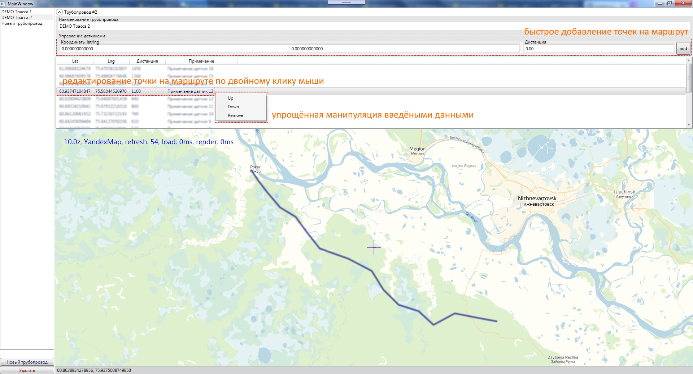
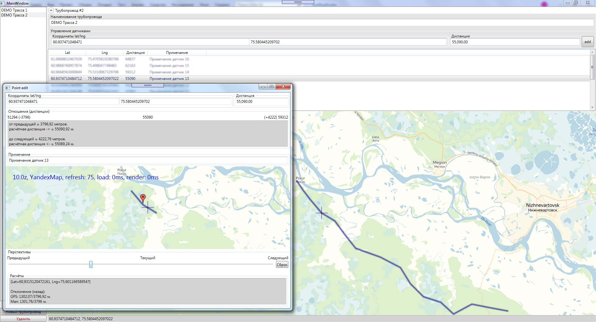

# pipeline map routes
Wpf mvvm map app

Рисование на картах при помощи координат

Важно!
На текущий момент в оригинальной "GMap.NET" ещё не принято [исправление ошибки](https://github.com/radioman/greatmaps/pull/157/).
Без этой заплатки не возможно корреткное позиционирование на выбранном маршруте.
Алтернативная ветка (с испралением) [будет доступна](https://github.com/badhitman/greatmaps) до тех пор пока эти исправления не будут применены в оригинале.

